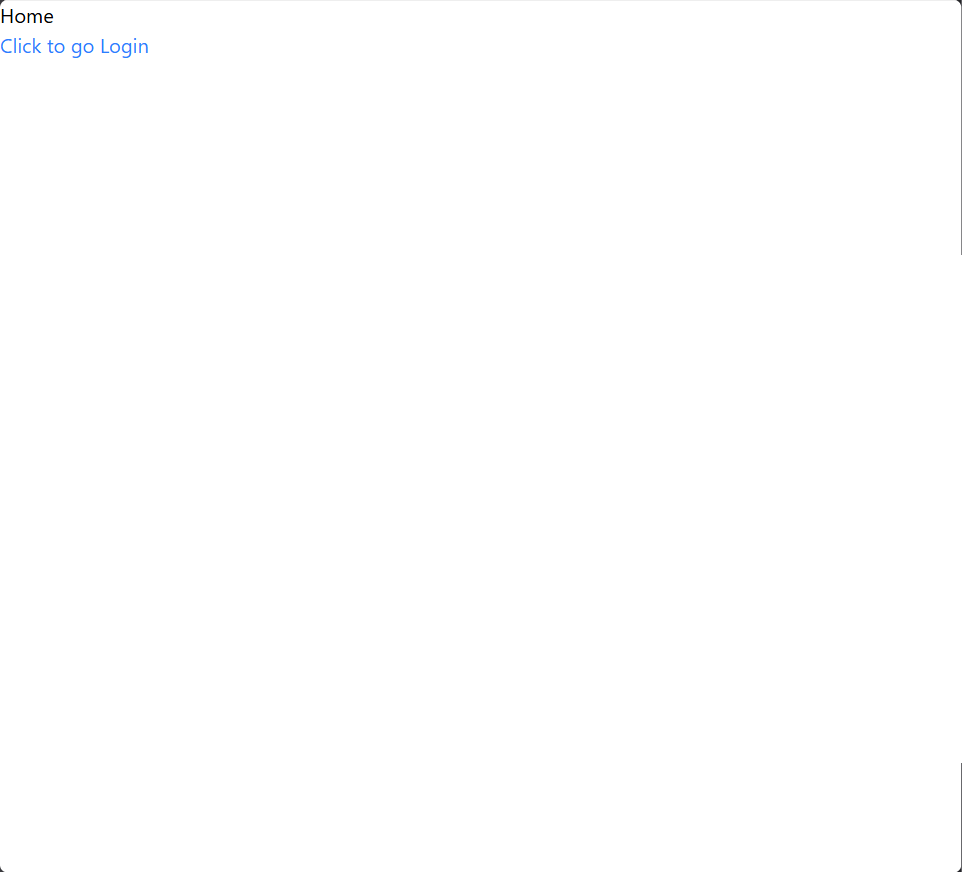
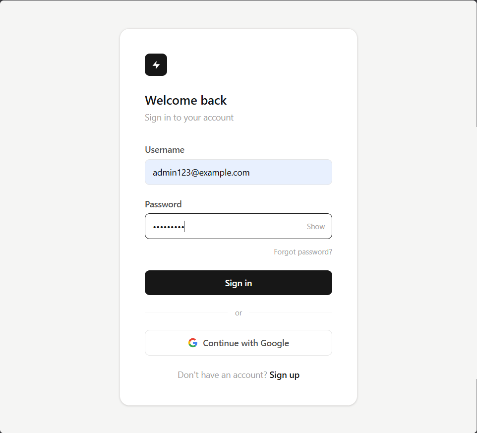
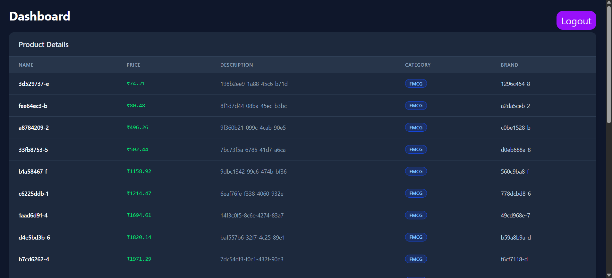

# Product Inventory & Auth System

A short description of what this project does and who it's for.

## Project Demostration

This project includes a walkthrough video and screenshots below demonstrating its core features and usage.

_Click the thumbnail above to watch the full demo video._

## Screenshots

  
  
  

## Swagger-api

<a href='https://product-service-fullstack.onrender.com/swagger-ui/index.html' title='Swagger API Docs'>Swagger API Documentation</a>
